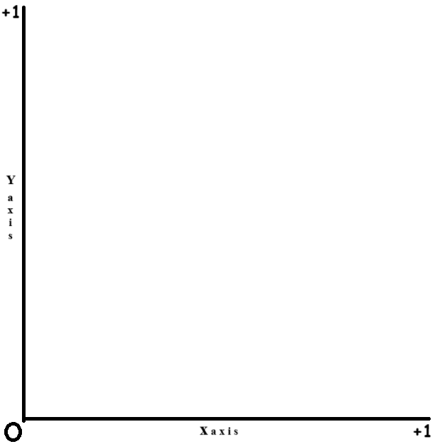
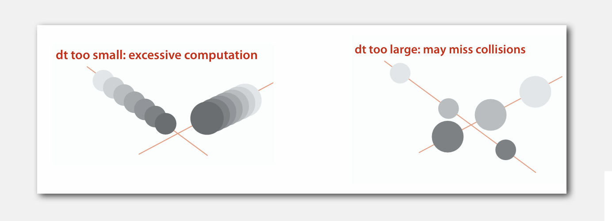

<a id="readme-top"></a>

<!-- PROJECT SHIELDS -->
<!--
*** I'm using markdown "reference style" links for readability.
*** Reference links are enclosed in brackets [ ] instead of parentheses ( ).
*** See the bottom of this document for the declaration of the reference variables
*** for contributors-url, forks-url, etc. This is an optional, concise syntax you may use.
*** https://www.markdownguide.org/basic-syntax/#reference-style-links
-->

[![Contributors][contributors-shield]][contributors-url]
[![Forks][forks-shield]][forks-url]
[![Stargazers][stars-shield]][stars-url]
[![Issues][issues-shield]][issues-url]
[![project_license][license-shield]][license-url]
[![LinkedIn][linkedin-shield]][linkedin-url]

<!-- PROJECT LOGO -->
<br />
<div align="right">
</div>
<div align="center">
  <a href="https://github.com/CabbitKheema/event-driven-simulation-of-probabilistic-heat-transfer-in-gases">
    
  </a>

<h3 align="center">event-driven-simulation-of-probabilistic-heat-transfer-in-gases</h3>

  <p align="center">
    An <a href="https://github.com/CabbitKheema/event-driven-simulation-of-probabilistic-heat-transfer-in-gases">event-driven 2D simulation of probabilistic heat transfer</a> via particle motion, driven by entropy and the Maxwell-Boltzmann distribution.
    <br />
    <a href="https://github.com/CabbitKheema/event-driven-simulation-of-probabilistic-heat-transfer-in-gases"><strong>Explore the docs »</strong></a>
    <br />
    <br />
    <a href="https://github.com/CabbitKheema/event-driven-simulation-of-probabilistic-heat-transfer-in-gases">View Demo</a>
    &middot;
    <a href="https://github.com/CabbitKheema/event-driven-simulation-of-probabilistic-heat-transfer-in-gases/issues/new?labels=bug&template=bug-report---.md">Report Bug</a>
    &middot;
    <a href="https://github.com/CabbitKheema/event-driven-simulation-of-probabilistic-heat-transfer-in-gases/issues/new?labels=enhancement&template=feature-request---.md">Request Feature</a>
  </p>
</div>

<!-- TABLE OF CONTENTS -->
<details>
  <summary>Table of Contents</summary>
  <ol>
    <li>
      <a href="#about-the-project">About The Project</a>
      <ul>
        <li><a href="#built-with">Built With</a></li>
      </ul>
    </li>
    <li>
      <a href="#getting-started">Getting Started</a>
      <ul>
        <li><a href="#prerequisites">Prerequisites</a></li>
        <li><a href="#installation">Installation</a></li>
        <li><a href="#begin-simulation">Begin Simulation</a></li>
      </ul>
    </li>
    <li>
      <a href="#theory-and-implementation">Probabilistic heat transfer simulation theory and implementation</a>
      <ul>
        <li><a href="#basic-terms">Basic terms to know in Thermodynamics</a></li>
        <li><a href="#steps-to-simulate">Steps to simulate heat transfer between randomly moving particles</a></li>
        <li><a href="#probabilistic-nature-of-heat-transfer">The probabilistic nature of heat transfer</a></li>
        <li><a href="#simulation-technique">Simulation technique</a></li>
        <li><a href="#implementation-in-java">Implementation in java</a></li>
      </ul>
    </li>
    <li><a href="#usage">Usage</a></li>
    <li><a href="#roadmap">Roadmap</a></li>
    <li><a href="#contributing">Contributing</a></li>
    <li><a href="#license">License</a></li>
    <li><a href="#contact">Contact</a></li>
    <li><a href="#acknowledgments">Acknowledgments</a></li>
  </ol>
</details>

<p align="right">(<a href="#readme-top">back to top</a>)</p>

<!-- ABOUT THE PROJECT -->

## About The Project

<p align="center">
  <a href="https://github.com/CabbitKheema/event-driven-simulation-of-probabilistic-heat-transfer-in-gases">
    
  </a>
</p>

Heat transfer is often seen as a straightforward flow from hot to cold, but at the microscopic level, it’s driven by probability. Particle motion and collisions occur randomly, making energy exchange a matter of chance rather than certainty. This simulation captures that randomness through an event-driven model of individual particle interactions. A non-conductive barrier with a small gap allows for limited, probabilistic exchanges, reflecting the stochastic nature of molecular diffusion and conduction. This approach offers a clear, intuitive visualization of how random interactions govern heat transfer—revealing dynamics that traditional models often overlook.

### Why This Approach is Superior?

- **Realistic Particle Dynamics:** The simulation models individual particle interactions rather than relying on bulk thermodynamic equations, providing a more granular and accurate visualization of heat transfer phenomena.

- **Event-Driven Efficiency:** Unlike time-stepped simulations, this event-driven approach updates only when meaningful interactions occur (like collisions), making it computationally efficient and scalable.

- **Probabilistic Heat Transfer:** The use of probabilistic models for particle exchange through the barrier accurately reflects molecular diffusion and conduction, offering deeper insights into stochastic heat flow.

- **Customizable Barriers and Gaps:** The inclusion of a non-conductive barrier with a modifiable gap allows exploration of different physical constraints and their effects on heat transfer rates.

- **Visual Insight into Thermodynamics:** By providing an intuitive visualization of particle movement and energy exchange, the simulation serves as both a research tool and an educational resource.

The simulation program is part of `algs4.jar`, which accompanies the textbook [_Algorithms, 4th Edition_][algorithms-4th-edition-url] by **Robert Sedgewick** and **Kevin Wayne**, Addison-Wesley Professional, 2011, ISBN 0-321-57351-X. It provides a framework for simulating particles undergoing elastic collisions within a unit box using an event-driven approach.

Thanks to all the tools and technologies mentioned in <a href="#acknowledgments">Acknowledgments</a> section below without which this project would've been incomplete!

<p align="right">(<a href="#readme-top">back to top</a>)</p>

### Built With

- [![Java][Java]][Java-url]

<p align="right">(<a href="#readme-top">back to top</a>)</p>

<!-- GETTING STARTED -->

## Getting Started

To get a local copy up and running, follow these simple steps.

### Prerequisites

Download and install **JDK (Java Development Kit)** and **JRE (Java Runtime Environment)**
  
#### 1. Install on linux

- Run the following command in the `Terminal`

  ```sh
  sudo apt install default-jdk && sudo apt install default-jre
  ```

- Verify you have this command available in your terminal and that the found version look similar to the below output

  ```sh
  java -version

  openjdk version "21.0.6" 2025-01-21
  OpenJDK Runtime Environment (build 21.0.6+7-Ubuntu-124.04.1)
  OpenJDK 64-Bit Server VM (build 21.0.6+7-Ubuntu-124.04.1, mixed mode, sharing)
  ```

#### 2. Install on Windows

- Installing Temurin (Adoptium) Java version since it’s stable, open source, and widely used. Run the following command in `Windows Powershell`

  ```sh
  winget install --id EclipseAdoptium.Temurin.21.JDK
  ```

- Verify you have this command available in your terminal and that the found version look similar to the below output

  ```sh
  java -version
    
  openjdk version "21.0.6" 2025-01-21 LTS
  OpenJDK Runtime Environment Temurin-21.0.6+7 (build 21.0.6+7-LTS)
  OpenJDK 64-Bit Server VM Temurin-21.0.6+7 (build 21.0.6+7-LTS, mixed mode, sharing)
  ```

<p align="right">(<a href="#readme-top">back to top</a>)</p>

### Installation 🌱 <a id="installation"></a>

#### 1. Clone the repo

- Run this command in terminal
  
  ```sh
  git clone https://github.com/CabbitKheema/event-driven-simulation-of-probabilistic-heat-transfer-in-gases.git
  ```

#### 2. Assume files in `data` directory to be unchanged to avoid pushing updates to base which would delete the template for simulation test case generation <a id="assume-unchanged"></a>

- Run this command in terminal
  
  ```sh
  git ls-files data | xargs git update-index --assume-unchanged
  ```

  > To reverse this assumption, run the following command:

  ```sh
  git ls-files data | xargs git update-index --no-assume-unchanged
  ```

<p align="right">(<a href="#readme-top">back to top</a>)</p>

### Begin Simulation 🚀 <a id="begin-simulation"></a>

#### 1. Make the file `run_probabilistic_heat_transfer.sh` executable

- Run this command in terminal to change file permission

  ```sh
  chmod +x run_probabilistic_heat_transfer.sh
  ```

#### 2. Tweak argument file for simulation test case generation (if necessary)

- Change `data/argument.txt` file contents to tweak the simulation test case
  
  ```js
  200       // Number of particles in the simulation
  0.02      // Size of blocker particles
  -0.005    // Left side particle min velocity
  0.005     // Left side particle max velocity
  0.005     // Left side particle min radius
  0.01      // Left side particle max radius
  0.4       // Left side particle min mass
  0.5       // Left side particle max mass
  -0.0005   // right side particle min velocity
  0.0005    // right side particle max velocity
  0.005     // right side particle min radius
  0.01      // right side particle max radius
  0.4       // right side particle min mass
  0.5       // right side particle max mass
  ```

  > Remove comments before next step

#### 3. Start simulating heat transfer between particles

- For linux, run the following command in `terminal`

  ```sh
  ./run_probabilistic_heat_transfer.sh
  ```

- For windows, run the following command in `git bash`

  ```sh
  bash ./run_probabilistic_heat_transfer.sh
  ```
- Verify this output
  
  ```sh
  Compiling Java files...
  Note: src\MinPQ.java uses unchecked or unsafe operations.
  Note: Recompile with -Xlint:unchecked for details.
  Generating simulation input...
  Running CollisionSystem...
  Execution completed successfully!
  ```

#### 4. Event-driven simulation for **_200_** particles

https://github.com/user-attachments/assets/4193918d-8a27-4d56-96e6-885087edbc79

<p align="right">(<a href="#readme-top">back to top</a>)</p>

## <a id="theory-and-implementation"></a> 🎲🖥️ Probabilistic heat transfer simulation theory and implementation

Simulation is the process of modeling a real-world system or process using a computer program, mathematical model, or physical setup to study its behavior under different conditions. It allows researchers, engineers, and scientists to analyze complex systems without experimenting directly in the real world.

Simulations are widely used in various fields, including:

- 👩‍🔬 **Physics & Engineering**: Modeling heat transfer, fluid dynamics, and structural mechanics.
- 💊 **Medicine & Biology**: Simulating disease spread, drug interactions, or biological systems.
- 🏦 **Finance**: Predicting stock market trends and assessing risk.
- 🎮 **Gaming & Virtual Reality**: Creating realistic environments and AI behavior.
- 🌦️ **Weather Forecasting**: Simulating atmospheric conditions to predict future weather.

Simulation is a powerful tool for understanding complex physical processes, such as heat transfer. In thermodynamics, heat transfer occurs due to the movement of energy between particles, often driven by random motion and probabilistic interactions. To accurately model this behavior, it is essential to understand key thermodynamic concepts, the steps involved in simulating heat transfer between particles, and the role of probability in determining energy exchange.

One effective approach to handling these interactions is **event-driven simulation**, which can be efficiently implemented using a **Minimum Priority Queue (MinPQ)**. This method allows for precise tracking of particle collisions and heat transfer events. In this project, we implement a 2D particle-based heat transfer simulation in Java, making use of MinPQs to model realistic energy exchange dynamics.

### 📚🔥 Basic terms to know in Thermodynamics <a id="basic-terms"></a>

#### 1. 🔥 Heat

Heat is a form of energy that is transferred between objects or systems due to a temperature difference. It always flows from a region of higher temperature to a region of lower temperature until thermal equilibrium is reached.

Heat can be transferred in three main ways:

1. **Conduction**: Direct transfer through a material (e.g., a metal spoon getting hot in soup).
2. **Convection**: Transfer via fluid movement (e.g., warm air rising, cool air sinking).
3. **Radiation**: Transfer via electromagnetic waves (e.g., the Sun warming the Earth).

In simple terms, heat is energy in motion due to temperature differences.

#### 2. 🌡️ Temperature

Temperature is a measure of the average kinetic energy of the particles in a substance. It tells us how hot or cold something is.

- When particles move faster, the temperature is higher.
- When particles move slower, the temperature is lower.

#### 3. 📊 Maxwell–Boltzmann distribution:

Maxwell-Boltzmann distribution describes the spread of speeds of particles in a gas (or liquid) at a given temperature.

<div align="center">

</div>

In a container with different temperatures:

- The hotter region has a Maxwell-Boltzmann distribution that is wider, meaning more particles have higher speeds.
- The colder region has a distribution that is narrower, meaning most particles have lower speeds.

However, there is always some overlap between these distributions—meaning some cold particles might be moving fast, and some hot particles might be moving slow.

#### 4. ♻️🔥 Entropy and The Second Law of Thermodynamics

Entropy is a measure of disorder or randomness in a system. It describes how energy is spread out and how much of it is available to do work.

Key Ideas:

- 📈 **Higher entropy**: More disorder (e.g., gas molecules spreading out in a room).
- 📉 **Lower entropy**: More order (e.g., ice crystals in a solid structure).

Second Law of Thermodynamics states that

**_"The total entropy of an isolated system can never decrease over time. It either increases or remains constant in a reversible process"_**

<div align="center">

</div>

This means energy naturally spreads out and becomes less useful.

Everyday Examples:

- 🧊 **Ice melting**: Orderly solid turns into disordered liquid (entropy increases).
- 🃏 **Shuffling a deck of cards**: An ordered arrangement becomes random.
- 🔥 **Burning wood**: Organized chemical energy turns into heat, light, and gases, increasing entropy.

In simple terms, entropy is nature’s tendency toward chaos!

#### 5. 🔒🌍 Isolated System

An isolated system in thermodynamics is a system that **does not exchange either energy or matter** with its surroundings.

Key Features of an Isolated System:

- ❌ **No energy transfer** (no heat, work, or radiation in or out).
- ❌ **No matter transfer** (mass remains constant inside).

Examples:

- **An ideal thermos flask** (perfect insulation prevents heat exchange).
- **The universe (as a whole)**: No outside system to exchange energy/matter with.
- **A perfectly insulated box** (in theory, it would maintain its internal energy forever).

Comparison with Other Systems:

| System Type         | Exchanges Energy? | Exchanges Matter? | Example                |
| ------------------- | ----------------- | ----------------- | ---------------------- |
| **Open System**     | ✅ Yes            | ✅ Yes            | Boiling pot of water   |
| **Closed System**   | ✅ Yes            | ❌ No             | Sealed pressure cooker |
| **Isolated System** | ❌ No             | ❌ No             | Ideal thermos flask    |

In reality, true isolated systems **don’t exist** because some energy always leaks out, but we often approximate them in physics.

<p align="right">(<a href="#readme-top">back to top</a>)</p>

### 📋✅ Steps to simulate heat transfer between randomly moving particles <a id="steps-to-simulate"></a>

Molecular Dynamics (MD) is a computer simulation technique used to study the motion and interactions of atoms and molecules over time. It is based on solving Newton’s equations of motion for a system of particles, where forces between particles are calculated using predefined potential energy functions.

We will be considering the particles in our simulation to represent energy-packets/molecules present in gases.

If we simulate movements and collisions of particles using the concept of molecular dynamics, we will be able to theoretically simulate the transfer of heat between those particles.

This is possible because `Temperature ∝ Kinetic energy ∝ Velocity` of the particles. The change in velocity of particles post-collision with other particles or the wall of our isolated system will be considered as heat transfered between those particles since there will be exchange of kinetic energies between them.

> The particles must follow the nature of hard disks, elastic collision and conservation of momentum.

The following steps help us in understanding the probabilistic nature of heat transfer. We will be considering a simulation where temperature is represented as average kinetic energy of all the particles moving randomly in an isolated system.

1. Consider an isolated 2D system with dimension [0, +1] on x-axis and [0, +1] on y-axis

<div align="center">
    
</div>

2. The left half of this system contains particles having high temperature (in other words a region of system having high average kinetic energy)

<div align="center">
    
</div>

3. The right half of this system contains particles having low temperature (in other words a region of system having low average kinetic energy)

<div align="center">
    
</div>

4. Seperating these two is a vertical wall of high mass particles stacked on top of one another

<div align="center">
    
</div>

5. This seperation makes the regions behave as closed systems within the enclosing isolated system (The average kinetic energy in both regions is conserved)

<div align="center">
    
</div>

6. A small gap is created in the middle vertical wall of high mass particles which would allow the particles in left and right closed systems to interact with one another

7. This allows the two closed systems to behave as open systems with the gap acting as a place where heat is transmitted by molecular conduction

https://github.com/user-attachments/assets/4193918d-8a27-4d56-96e6-885087edbc79

<p align="right">(<a href="#readme-top">back to top</a>)</p>

### <a id="probabilistic-nature-of-heat-transfer"></a> 🤔 Why do fast-moving (hot) particles tend to move into the colder region more frequently than slow-moving (cold) particles move into the hotter region?

#### 1. Random Motion & Collisions:

- Particles in a gas or liquid are always moving and colliding.
- The hotter region has more high-energy (fast) particles, while the colder region has more low-energy (slow) particles.

#### 2. Maxwell-Boltzmann Distribution:

- The speed (kinetic energy) of particles follows a probability distribution.
- At higher temperatures, the distribution is skewed toward higher speeds, meaning more particles have enough energy to cross the gap.

#### 3. Net Energy Transfer (Hot → Cold):

- Even though individual movements are random, when summed over many particles, there is a net flow of energy from hot to cold.
- This follows the Second Law of Thermodynamics, which states that entropy (disorder) increases over time, driving energy to spread out.

#### 4. Energy Exchange & Probability:

- Some fast-moving particles from the hot region randomly move into the cold region through the small gap.
- Some slow-moving particles from the cold region randomly move into the hot region.
- However, on average, more high-energy particles move into the cold region than the other way around, because there are more of them on the hot side.

The probabilistic nature of heat transfer from hot to cold region is clearer when the number of particles in the isolated system increases.

<div align="center">
    <video width="500px" controls>
        <source src="./videos/normal_heat_transfer_1000_particles.mp4" type="video/mp4">
        Your browser does not support the video tag.
    </video>
</div>

According to most sources, a cubic centimeter of air contains approximately **_2.7 × 10¹⁹_** molecules. When this many particles are involved, the transfer of heat from a cold region to a hot region is improbable (almost zero), which is why heat always travels from hot regions to cold regions and not the other way around.

<p align="right">(<a href="#readme-top">back to top</a>)</p>

### 🕘🤹🥂 <a id="simulation-technique"></a> Simulation technique

The goal is to simulate the motion of **_N_** moving particles that behave according to **the laws of elastic collision**. In order to do this, the basic step is to ensure that the particles follow something called as a **Hard disc model**.

- Moving particles interact via elastic collisions with each other and walls.
- Each particle is a disc with known position, velocity, mass, and radius.
- No other forces.

The next step is to find a technique that creates and supports the simulation.

#### 🕘 **Time-driven simulation**

The Brute-force approach would be to use a Time-driven simulation which follows these rules,

<div align="center">
    
</div>

- Discretize time in quanta of size **_dt_**.
- Update the position of each particle after every **_dt_** units of time, and check for overlaps.
- If overlap, roll back the clock to the time of the collision, update the velocities of the colliding particles, and continue the simulation.

#### 👎 Main drawbacks of a time-driven simulation

<div align="center">
    
</div>

- **~ _N²/ 2_** overlap checks per time quantum.
- Simulation is too slow if **_dt_** is very small.
- May miss collisions if **_dt_** is too large. (if colliding particles fail to overlap when we are looking)

In order to have a simulation that scales well, the technique we choose must complete the task in at least **~ _N log N_** time complexity.

#### 🥂 **Event-driven simulation**

Event-driven simulation is a computational approach where system changes occur at discrete events rather than at fixed time steps. Instead of updating all elements at regular intervals, the simulation processes only the next scheduled event, improving efficiency, especially in systems with infrequent interactions. A **priority queue** (MinPQ) is commonly used to manage events, ensuring that they are processed in chronological order. This method is widely used in physics simulations, network modeling, and queuing systems, where interactions between entities happen sporadically rather than continuously.

This technique changes state only when something happens

- Between collisions, particles move in straight-line trajectories.
- Focus only on times when collisions occur.
- Maintain **PQ** of collision events, prioritized by time.
- Remove the min = get next collision.

<div align="center">
    
</div>

- **Collision prediction:** Given position, velocity, and radius of a particle, when will it collide next with a wall or another particle?
- **Collision resolution:** If collision occurs, update colliding particle(s) according to laws of elastic collisions.

The following describes different collisions the particles would experience in our isolated system. It also includes the **math** behind predicting and resolving such collisions.

#### 🧱 **Predicting and resolving a particle-wall collision**

- Particle of radius **_s_** at position **_(rx, ry)_**.
- Particle moving in unit box with velocity **_(vx, vy)_**.
- Will it collide with a vertical wall? If so, when?

<div align="center">
    
</div>

#### ⏰ **Predicting a particle-particle collision**

- **Particle i:** radius **_sᵢ_**, position **_(rxᵢ, ryᵢ)_**, velocity **_(vxᵢ, vyᵢ)_**.
- **Particle j:** radius **_sⱼ_**, position **_(rxⱼ, ryⱼ)_**, velocity **_(vxⱼ, vyⱼ)_**.
- Will particles **_i_** and **_j_** collide? If so, when?

<div align="center">
    
    
</div>

#### 💥 **Resolving a particle-particle collision**

- When two particles collide, how does velocity change?

<div align="center">
    
</div>

<p align="right">(<a href="#readme-top">back to top</a>)</p>

### <a id="implementation-in-java"></a> 🖥️ Implementation in java

The `Particle.java`, `CollisionSystem.java`, and `Event.java` classes from [_Algorithms, 4th Edition_][algorithms-4th-edition-url] by **Robert Sedgewick** and **Kevin Wayne** provide a framework for simulating particles undergoing elastic collisions within a unit box using an event-driven approach.

#### Particle.java

- The `Particle` class models a particle with attributes such as position, velocity, radius, mass, and color.
- It offers methods to move the particle, predict collision times with walls and other particles, and resolve these collisions elastically.
- The class is mutable, allowing the particle's state to change over time as it interacts within the system.
- [View Source Code][particle-java-source-code-url]

#### CollisionSystem.java

- The `CollisionSystem` class manages a collection of `Particle` instances, simulating their motion and interactions based on the principles of elastic collisions.
- It employs an event-driven simulation approach using a priority queue to efficiently process events, such as particle collisions and redraw events.
- The system supports initializing particles either randomly or from input data and provides visualization capabilities to observe the simulation in real-time.
- [View Source Code][collisionsystem-java-source-code-url]

#### Event.java

- The `Event` class represents an event in the priority queue of the collision system.
- Each event stores a timestamp and can represent either a particle collision, a wall collision, or a redraw event.
- To ensure event validity, it tracks the number of collisions each particle has experienced.
- If a particle's collision count has changed since the event was scheduled, the event is considered invalid and discarded.
- [View Source Code][event-java-source-code-url]

Together, these classes demonstrate the application of algorithms and data structures in simulating physical systems, highlighting concepts like event-driven simulation, priority queue management, and elastic collisions.

> For better understanding watch **Tutorial-4** titled **_Event-Driven Simulation (optional)_** in **Module 8** of the free course [Algorithms, Part I][algorithms-part-i-url] by Princeton university on [coursera][coursera-url].

<p align="right">(<a href="#readme-top">back to top</a>)</p>

<!-- USAGE -->

## Usage

Check <a href="#begin-simulation">this</a>. 👆

<!-- ROADMAP -->

<p align="right">(<a href="#readme-top">back to top</a>)</p>

## Roadmap

<!-- CONTRIBUTING -->

<p align="right">(<a href="#readme-top">back to top</a>)</p>

## Contributing

Contributions are what make the open source community such an amazing place to learn, inspire, and create. Any contributions you make are **greatly appreciated**.

If you have a suggestion that would make this better, please fork the repo and create a pull request. You can also simply open an issue with the tag "enhancement".
Don't forget to give the project a star! Thanks again!

1. Fork the Project
2. Create your Feature Branch (`git checkout -b feature/AmazingFeature`)
3. Commit your Changes (`git commit -m 'Add some AmazingFeature'`)
4. Push to the Branch (`git push origin feature/AmazingFeature`)
5. Open a Pull Request

### Top contributors:

<a href="https://github.com/CabbitKheema/event-driven-simulation-of-probabilistic-heat-transfer-in-gases/graphs/contributors">
  
</a>

<p align="right">(<a href="#readme-top">back to top</a>)</p>

<!-- LICENSE -->

## License

Distributed under the MIT License. See `LICENSE` for more information.

<p align="right">(<a href="#readme-top">back to top</a>)</p>

<!-- CONTACT -->

## Contact

Prajwal K - [@CabbitKheema](https://twitter.com/CabbitKheema) - <mrprajwalkrishnamurthy@gmail.com> - [HackerRank](https://www.hackerrank.com/profile/CabbitKheema)

Project Link: [https://github.com/CabbitKheema/event-driven-simulation-of-probabilistic-heat-transfer-in-gases](https://github.com/CabbitKheema/event-driven-simulation-of-probabilistic-heat-transfer-in-gases)

<p align="right">(<a href="#readme-top">back to top</a>)</p>

<!-- ACKNOWLEDGMENTS -->

## Acknowledgments

- [My rough Roadmap Document](https://docs.google.com/document/d/1amjK7CFRevE383NgdGlcximGoc-gRg1G5pU6FHWIXnE/edit?usp=sharing)
- [Algorithms, Part I](https://www.coursera.org/learn/algorithms-part1)
- [Java Algorithms and Clients | Algorithms, 4th Edition ](https://algs4.cs.princeton.edu/code/)
- [The Most Misunderstood Concept in Physics](https://youtu.be/DxL2HoqLbyA?si=5UzSX48UZea3SkPj)
- [Heat](https://youtu.be/ldMcDvm29eA?si=0mFV1fCY_aO5kyoQ)
- [Maxwell-Boltzmann distribution](https://youtu.be/ftjwF0TC2c8?si=6vKSrwZBQ3-P1f6D)
- [The Maxwell–Boltzmann distribution (video) | Khan Academy](https://www.khanacademy.org/science/ap-chemistry-beta/x2eef969c74e0d802:intermolecular-forces-and-properties/x2eef969c74e0d802:kinetic-molecular-theory/v/maxwell-boltzmann-distribution)
- [Fourier's Law of Heat Conduction | Heat and Mass Transfer](https://youtu.be/C3OIj7iYCF8?si=loDSwJJor-tv5pM_)
- [Fick's law of diffusion (video) | Khan Academy](https://www.khanacademy.org/science/health-and-medicine/respiratory-system/gas-exchange-jv/v/fick-s-law-of-diffusion)
- [Second law of thermodynamics (video) | Khan Academy](https://www.khanacademy.org/science/thermal-physics-essentials/x34146f1b92e003ad:how-is-the-universe-going-to-end/x34146f1b92e003ad:second-law-of-thermodynamics-lesson/v/second-law-of-thermodynamics)
- [MARKDOWN SYNTAX](https://enterprise.github.com/downloads/en/markdown-cheatsheet.pdf)
- [Best README template by Othneil Drew](https://github.com/othneildrew/Best-README-Template/tree/main?tab=readme-ov-file#installation)
- [Markdown Guide | Basic Syntax](https://markdownguide.offshoot.io/basic-syntax/)
- [List of useful Markdown Badges](https://ileriayo.github.io/markdown-badges/)
- [Choose an Open Source License](https://choosealicense.com)
- [GitHub Emoji Cheat Sheet](https://www.webpagefx.com/tools/emoji-cheat-sheet)
- [Img Shields](https://shields.io)

<p align="right">(<a href="#readme-top">back to top</a>)</p>

<!-- MARKDOWN LINKS & IMAGES -->
<!-- https://www.markdownguide.org/basic-syntax/#reference-style-links -->

[contributors-shield]: https://img.shields.io/github/contributors/CabbitKheema/event-driven-simulation-of-probabilistic-heat-transfer-in-gases.svg?style=for-the-badge
[contributors-url]: https://github.com/CabbitKheema/event-driven-simulation-of-probabilistic-heat-transfer-in-gases/graphs/contributors
[forks-shield]: https://img.shields.io/github/forks/CabbitKheema/event-driven-simulation-of-probabilistic-heat-transfer-in-gases.svg?style=for-the-badge
[forks-url]: https://github.com/CabbitKheema/event-driven-simulation-of-probabilistic-heat-transfer-in-gases/network/members
[stars-shield]: https://img.shields.io/github/stars/CabbitKheema/event-driven-simulation-of-probabilistic-heat-transfer-in-gases.svg?style=for-the-badge
[stars-url]: https://github.com/CabbitKheema/event-driven-simulation-of-probabilistic-heat-transfer-in-gases/stargazers
[issues-shield]: https://img.shields.io/github/issues/CabbitKheema/event-driven-simulation-of-probabilistic-heat-transfer-in-gases.svg?style=for-the-badge
[issues-url]: https://github.com/CabbitKheema/event-driven-simulation-of-probabilistic-heat-transfer-in-gases/issues
[license-shield]: https://img.shields.io/github/license/CabbitKheema/event-driven-simulation-of-probabilistic-heat-transfer-in-gases.svg?style=for-the-badge
[license-url]: https://github.com/CabbitKheema/event-driven-simulation-of-probabilistic-heat-transfer-in-gases/blob/master/LICENSE
[linkedin-shield]: https://img.shields.io/badge/-LinkedIn-black.svg?style=for-the-badge&logo=linkedin&colorB=555
[linkedin-url]: https://linkedin.com/in/mr-prajwal-k
[algorithms-4th-edition-url]: https://algs4.cs.princeton.edu/home/
[particle-java-source-code-url]: https://github.com/kevin-wayne/algs4/blob/master/src/main/java/edu/princeton/cs/algs4/Particle.java
[collisionsystem-java-source-code-url]: https://github.com/kevin-wayne/algs4/blob/master/src/main/java/edu/princeton/cs/algs4/CollisionSystem.java
[event-java-source-code-url]: https://github.com/kevin-wayne/algs4/blob/6157ca02644bdc24892ffbac1cf449d5169e71de/src/main/java/edu/princeton/cs/algs4/CollisionSystem.java#L137
[algorithms-part-i-url]: https://www.coursera.org/learn/algorithms-part1
[coursera-url]: https://www.coursera.org/
[Java]: https://img.shields.io/badge/JAVA-3a75b0?style=for-the-badge
[Java-url]: https://www.java.com/
